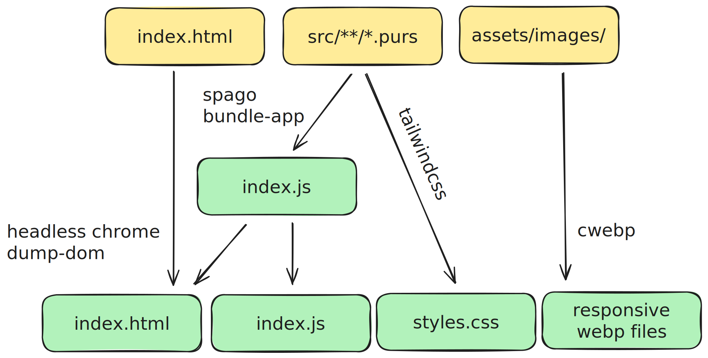

# [WIP] static-site-hello-world
Web dev is hard. This stack gives you more tools to deal with the suck. Mostly just a template for me to copy when I make new sites.

## The Build

- PureScript: Enforced functional language -> local reasoning for your complicated JS
- Tailwind CSS: Local reasoning for your CSS
- cwebp: Commit images in convenient formats to source, generate all the different sizes of `.webp` files you'll need. 
- Headless Chrome: PureScript Halogen apps are designed to start wtih an empty html doc. Totally works- but at the expense of FCP and LCP performance.

## Build Tools For Your Build Tools

- Turtle: My faith in bash scripts that curve over the horizon dwindles quickly
  
One day I will learn nix in earnest, but today is not that day. Installing this barrel of monkeys by hand sounds like a sad way to spend an afternoon, so a shell.nix would make a ton of sense- if I could get one to work.

## TODO
- learn nix
- automate generating responsively-sized images
