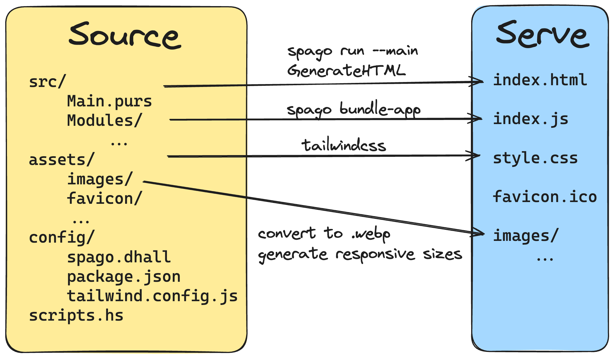

# [WIP] static-site-hello-world
Web dev is hard. This stack gives you more tools to deal with the suck. Mostly just a template for me to copy when I make new sites.

## Wat

## Build tools for your build tools
- JavaScript built from PureScript source
- CSS built from tailwindcss classnames in PureScript source
- Initial HTML file built from running PureScript module
- Responsive-sized .webp images built from source png or jpg images
- All those build commands are complicated, and my faith in lines of bash that curve over the horizon dwindles quickly, so in comes scripts.hs which (optionally) tests itself on every run.
- Installing this barrel of monkeys is cursed, so we use a nix derivation to never think about it again even when we move machines. You can ignore that and install it all by hand if you want though.

## TODO
- use formatters
- minify for prod
- local lighthouse audit